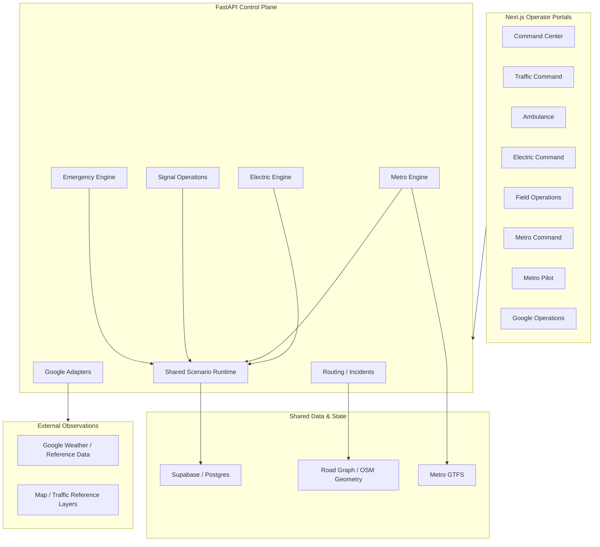
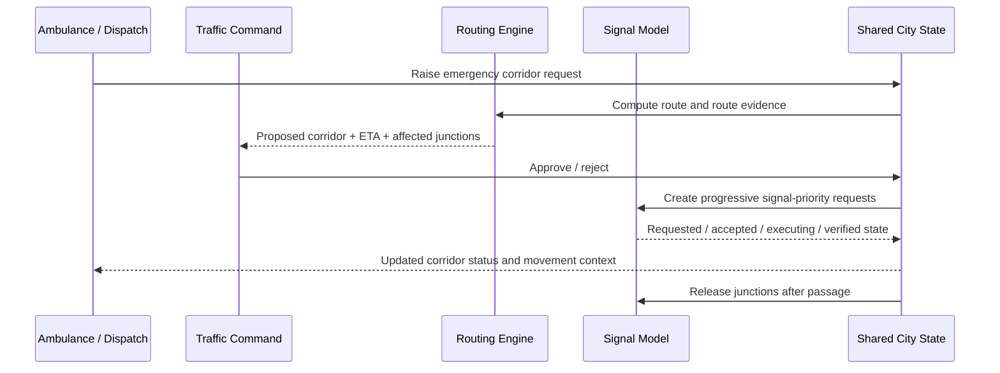

# ⚡ AegisGrid

<p align="center">
  <strong>Hyderabad Digital Twin for Infrastructure & Emergency Operations</strong>
</p>

<p align="center">
  A shared, simulation-first command system that connects traffic, emergency routing,
  metro operations, electrical infrastructure, weather context, and field response
  around one city operating picture.
</p>

<p align="center">
  <a href="https://web-nine-eta-66.vercel.app/command"><strong>Live Demo</strong></a>
  ·
  <a href="https://github.com/sai1876/hackathon"><strong>Repository</strong></a>
  ·
  <a href="AEGISGRID_APPROVED_WORKFLOW.md"><strong>Operating Model</strong></a>
  ·
  <a href="AEGISGRID_FUNCTIONAL_AUDIT_2026-09-04.md"><strong>Functional Audit</strong></a>
</p>

<p align="center">
  
  
  
  
  
  
  
</p>

---

## The Problem

Cities do not fail one system at a time.

A severe rain event can simultaneously:

- slow or block roads,
- trap an ambulance in traffic,
- overload intersections,
- shift passenger demand toward metro,
- increase or disrupt electrical demand,
- create field-service tasks across multiple departments.

Most operational tools remain siloed. Traffic sees traffic. Power sees power. Metro sees metro. Emergency teams coordinate through separate channels.

**AegisGrid explores a different operating model: one shared digital twin, one simulation clock, multiple department-specific command portals, and coordinated decisions built from the same city state.**

---

## What AegisGrid Does

AegisGrid combines a shared city simulation with domain-specific control surfaces for:

- **Command Center** — city-wide operating picture, scenario injection, shared model control
- **Traffic Command** — corridor review, road disruptions, signal operations
- **Ambulance** — emergency trip requests, destination and route workflow
- **Electric Command** — substations, feeders, transformers and modeled load
- **Field Operations / Lineman** — infrastructure field view
- **Metro Command** — network operations, passenger and service state
- **Metro Pilot** — operator-facing metro execution view
- **Google Operations** — external Google-backed observation/reference layers where enabled

The system is built around a **shared, versioned runtime** so that departments do not operate on independent copies of the city.

---

## Why It Is Different

### 1. One shared operational state

Traffic, metro, emergency and electrical views read from the same shared simulation model instead of isolated dashboard mockups.

### 2. Decisions, not just charts

AegisGrid is structured around operational transitions:

```text
Observe → Detect → Model Impact → Recommend / Request → Human Review → Apply → Verify → Recover
```

### 3. Human-in-the-loop by design

Safety-critical actions are not presented as magically autonomous real-world control. Operator approval remains explicit where required.

### 4. Provenance is part of the product

AegisGrid distinguishes:

- imported/source geometry,
- observed external data,
- generated infrastructure,
- modeled demand,
- simulated queues and motion,
- operator-entered events.

The system is intentionally designed not to present generated values as real telemetry.

### 5. Cross-domain consequences

A single scenario can affect more than one subsystem. Rain, congestion, power demand, metro demand and emergency response are modeled as parts of the same city state.

---

## System Architecture



### Shared-state principle

The current shared operating model uses a versioned Supabase-backed simulation run. Optimistic concurrency prevents stale mutations from silently overwriting newer state.

A normal mutation follows:

```text
Load latest state
      ↓
Apply mutation / advance model
      ↓
Version-checked commit
      ↓
Conflict?
   ┌──┴──┐
  No    Yes
  ↓      ↓
Publish  Reload → recalculate → retry
```

---

## Emergency Green-Corridor Workflow

One of AegisGrid's core scenarios is emergency-vehicle priority.



The intended operating rule is simple:

> **Plan the whole route, activate priority progressively, preserve safe signal transitions, and restore normal coordination after the ambulance passes.**

The current prototype uses simulation adapters. It does **not** claim to control Hyderabad traffic hardware.

---

## Shared Scenario Engine

The Command Center can inject modeled disruptions such as:

| Scenario | Example modeled consequence |
|---|---|
| Rainfall | Water accumulation, traffic slowdown, metro demand shift |
| Flood area | Road blockage / reduced accessibility |
| Traffic disruption | Reduced modeled road capacity |
| Signal failure | Junction-control disruption |
| Electrical demand | Increased modeled infrastructure loading |
| Metro demand | Increased station passenger arrival pressure |

Scenario inputs modify the shared model. They are **not** the same thing as the baseline digital-twin engine.

That distinction matters:

```text
SHARED DIGITAL TWIN
  ├─ baseline metro movement
  ├─ passenger state
  ├─ electrical state
  ├─ emergency state
  └─ signal state

OPTIONAL SCENARIO INPUTS
  ├─ rain
  ├─ flood
  ├─ traffic disruption
  ├─ signal failure
  ├─ electrical demand
  └─ metro demand
```

The baseline model may continue running with zero active disruption inputs.

---

## Data Provenance

AegisGrid treats provenance as a first-class requirement.

| Data / behavior | Classification | Notes |
|---|---|---|
| OpenStreetMap road geometry | **Source data** | Used for road topology / mapping |
| Metro GTFS | **Source schedule data** | Used for station and timetable modeling |
| Google weather/reference layers | **External observation/reference** | Enabled only through configured provider flags |
| Electrical topology / capacity assumptions | **Generated / modeled** | Not surveyed utility infrastructure |
| Passenger demand | **Simulated / historically anchored model** | Not live station footfall |
| Road traffic state | **Modeled / partial** | Not a citywide live traffic sensor feed |
| Ambulance motion | **Simulated / operator-driven** | Not live GPS unless explicitly connected |
| Signal acknowledgements | **Simulated controller state** | Not connected to physical Hyderabad controllers |

> **Rule:** A generated or simulated value must never be presented as a real-world observed reading.

---

## Portal Map

| Portal | Route | Primary responsibility |
|---|---|---|
| Command Center | `/command` | Shared city picture, scenarios, cross-domain monitoring |
| Traffic Command | `/traffic` | Emergency corridors, traffic and signal operations |
| Ambulance | `/ambulance` | Emergency vehicle request / trip workflow |
| Electric Command | `/electric-command` | Electrical infrastructure and modeled load |
| Field Operations | `/lineman` | Field-oriented infrastructure view |
| Metro Command | `/metro-command` | Metro network and passenger operations |
| Metro Pilot | `/metro-pilot` | Pilot/operator-facing metro view |
| Google Operations | `/google-operations` | Google-backed observation/reference operations |

Live deployment:

**https://web-nine-eta-66.vercel.app/command**

---

## Technology Stack

### Frontend

- **Next.js 16**
- **React 19**
- **TypeScript 6**
- **MapLibre GL 6**
- **Tailwind CSS 4**
- **Playwright** for browser testing

### Backend

- **Python 3.12**
- **FastAPI**
- **Uvicorn**
- **Supabase**
- **NetworkX**
- **Shapely**
- **HTTPX**

### Infrastructure

- **Vercel** — frontend deployment
- **Render** — FastAPI deployment
- **Supabase/Postgres** — shared simulation state
- **OpenStreetMap** — road geometry / basemap source
- **Google Maps Platform** — optional/reference integrations when enabled

---

## Repository Structure

```text
hackathon/
├── backend/
│   ├── main.py                  # FastAPI entry point
│   ├── scenario_runtime.py      # shared simulation authority
│   ├── route_engine.py          # routing
│   ├── incident_engine.py       # road incidents
│   ├── emergency_model.py       # emergency corridor simulation
│   ├── emergency_api.py
│   ├── electric_engine.py
│   ├── metro_engine.py
│   ├── metro_simulation.py
│   ├── signal_operations.py
│   ├── google_weather.py
│   ├── google_operations.py
│   └── scripts/                 # data generation/import tooling
│
├── web/
│   ├── src/app/                 # portal routes
│   ├── src/components/          # command, traffic, metro, emergency UI
│   ├── src/lib/                 # API and resilient polling utilities
│   └── public/
│
├── render.yaml
├── AEGISGRID_APPROVED_WORKFLOW.md
├── AEGISGRID_FUNCTIONAL_AUDIT_2026-09-04.md
├── EMERGENCY_WORKFLOW_IMPLEMENTATION.md
├── METRO_OPERATIONS_V3.md
└── README.md
```

---

## Quick Start

### Prerequisites

- Python **3.12+**
- Node.js compatible with the current Next.js toolchain
- npm
- Supabase project(s) matching the expected schema

### 1. Clone

```bash
git clone https://github.com/sai1876/hackathon.git
cd hackathon
```

### 2. Backend environment

Create `backend/.env` from `backend/.env.example`:

```env
SUPABASE_URL=https://your-project.supabase.co
SUPABASE_SERVICE_ROLE_KEY=server-only-key

SIMULATION_SUPABASE_URL=https://your-simulation-project.supabase.co
SIMULATION_SUPABASE_SERVICE_ROLE_KEY=simulation-server-only-key

CORS_ORIGINS=http://localhost:3000,http://127.0.0.1:3000
```

> Never expose Supabase service-role keys in frontend environment variables.

### 3. Install and run the backend

#### Windows PowerShell

```powershell
python -m venv .venv
.\.venv\Scripts\python.exe -m pip install -r backend\requirements.txt

cd backend
..\.venv\Scripts\python.exe -m uvicorn main:app --host 127.0.0.1 --port 8000
```

#### macOS / Linux

```bash
python3 -m venv .venv
source .venv/bin/activate
pip install -r backend/requirements.txt

cd backend
uvicorn main:app --host 127.0.0.1 --port 8000
```

Backend:

```text
http://127.0.0.1:8000
```

Health:

```text
GET /health
```

Readiness:

```text
GET /ready
```

### 4. Frontend environment

Create `web/.env.local`:

```env
NEXT_PUBLIC_API_URL=http://127.0.0.1:8000
```

### 5. Run the frontend

```bash
cd web
npm ci
npm run dev
```

Open:

```text
http://127.0.0.1:3000/command
```

---

## Core API Surface

AegisGrid exposes multiple domain APIs. Key examples include:

```text
GET  /health
GET  /ready

POST /route
GET  /incidents
POST /incidents

GET  /operations
POST /corridors
POST /corridors/{id}/decision
POST /corridors/{id}/position

POST /simulation/events

GET  /command/scenario
POST /command/scenario

GET  /metro/...
GET  /emergency
```

The API also mounts electrical, signal, Google-operations and metro-operation routers.

---

## Reliability & Concurrency

The shared scenario runtime uses optimistic concurrency because multiple portals can mutate the same city state.

Expected conflicts are treated as **recoverable coordination events**, not as database outages.

The runtime follows the invariant:

```text
fresh read → mutate → conditional commit
                 │
                 └─ conflict → reload → recalculate → retry
```

Deployment intentionally uses **one Uvicorn worker** for the current shared runtime configuration.

`/health` reports process liveness.

`/ready` reports whether the shared scenario runtime is ready to serve operational state.

---

## Deployment

### Backend — Render

`render.yaml` defines the Python service:

```yaml
startCommand: uvicorn main:app --host 0.0.0.0 --port $PORT --workers 1
healthCheckPath: /health
```

Required secrets are configured server-side.

Optional Google integrations are controlled through environment flags and a server-side Google Maps API key.

### Frontend — Vercel

Set before building:

```env
NEXT_PUBLIC_API_URL=https://your-backend.example.com
```

Then deploy the `web/` Next.js application.

---

## Validation

### Backend

From the repository root:

```bash
python -m unittest discover -s backend
```

### Frontend tests

```bash
npm test --prefix web
```

### TypeScript

```bash
npx tsc --noEmit --project web
```

### Production build

```bash
npm run build --prefix web
```

### Lint

```bash
npm run lint --prefix web
```

---

## Demo Flow for Judges

A short demonstration can show the core idea without switching between disconnected mockups.

### 1. Start at Command Center

Open `/command`.

Show:

- one shared city map,
- database/runtime status,
- metro and electrical overlays,
- scenario controls,
- shared operational feed.

### 2. Inject a disruption

Create a rain, flood, traffic, signal, electrical-demand or metro-demand input.

Explain that the event is written into the **same shared model** used by every department.

### 3. Show cross-domain consequences

Open the relevant department view:

- traffic / signals,
- metro,
- electric,
- emergency.

The important point is not the animation — it is that all views are reading the same versioned state.

### 4. Raise an emergency corridor

Use `/ambulance` to create an emergency request.

Review it from `/traffic`.

Show route evidence, corridor status and signal-priority workflow.

### 5. Explain the safety boundary

Close with:

> AegisGrid currently simulates controller execution. It demonstrates coordinated decision logic and operational workflow without pretending that a hackathon prototype is connected to real city infrastructure.

---

## Current Scope & Honest Limitations

AegisGrid is a **working hackathon / research prototype**, not a deployed municipal control system.

Current limitations include:

- no production-grade city/operator identity and authorization boundary yet,
- no connection to real Hyderabad signal controllers,
- no verified utility GIS for all modeled electrical assets,
- passenger and road-traffic models still require calibration,
- some cross-domain consequences are simplified,
- Google observations and simulation state are intentionally kept as separate provenance classes,
- legacy and newer operational modules still coexist in parts of the codebase,
- safety-critical infrastructure actions remain simulated.

These are deliberate boundaries to keep the demo truthful.

---

## Decision Intelligence & AI Boundary

AegisGrid is designed for **AI-assisted urban operations**, but it does not treat an LLM as an unquestioned control authority.

The intended decision layer can:

- summarize multi-domain evidence,
- rank or explain operational recommendations,
- surface conflicts and uncertainty,
- assist operators with prioritization,
- support post-event analysis.

It should **not** silently override assigned medical priority, invent live telemetry, or directly actuate city infrastructure without validated interfaces and authorization.

The current repository primarily demonstrates the deterministic shared-state, simulation and operator-control foundation on which that decision layer can safely sit.

---

## Roadmap

- [ ] Production authentication and role-based authorization
- [ ] Durable operator identity and audit trail
- [ ] Calibrated road traffic density / queue model
- [ ] Platform- and direction-aware metro passenger model
- [ ] Executable metro recommendations with approval
- [ ] Validated electrical topology and protection behavior
- [ ] Police / lineman / municipal field-task lifecycle
- [ ] AI recommendation agent with evidence, confidence and human approval
- [ ] Persistent scenario replay / branching
- [ ] Real controller adapters only where a supported authority-approved interface exists
- [ ] Expanded Hyderabad coverage and performance profiling

---

## Design Principles

AegisGrid follows five rules:

1. **One city, one shared state**
2. **Simulation must be labelled as simulation**
3. **Observed data and generated data must never be mixed silently**
4. **Human approval stays in the loop for high-impact actions**
5. **A failed subsystem must degrade visibly, not fabricate success**

---

## Documentation

Important project documents:

- [`AEGISGRID_APPROVED_WORKFLOW.md`](AEGISGRID_APPROVED_WORKFLOW.md) — approved operating behavior
- [`AEGISGRID_FUNCTIONAL_AUDIT_2026-09-04.md`](AEGISGRID_FUNCTIONAL_AUDIT_2026-09-04.md) — implementation audit and known gaps
- [`EMERGENCY_WORKFLOW_IMPLEMENTATION.md`](EMERGENCY_WORKFLOW_IMPLEMENTATION.md) — emergency workflow implementation
- [`METRO_OPERATIONS_V3.md`](METRO_OPERATIONS_V3.md) — metro operations model
- [`OPERATIONAL_REDESIGN.md`](OPERATIONAL_REDESIGN.md) — operational redesign history
- [`MAIN_COMMAND_CENTER.md`](MAIN_COMMAND_CENTER.md) — command center implementation notes

---

## Security & Safety Notice

This repository contains a prototype for infrastructure and emergency-operation simulation.

Do not deploy it as a real municipal control system without:

- production authentication and authorization,
- audited data provenance,
- validated operational models,
- rate limiting and abuse protection,
- resilient infrastructure,
- formal fail-safe behavior,
- authority-approved hardware/controller interfaces,
- security review and operational certification.

**No simulated acknowledgement should be interpreted as confirmation from real city infrastructure.**

---

## Project Vision

AegisGrid is not trying to build another dashboard.

It is exploring what a city operating system could look like when transportation, emergency response, public infrastructure and decision intelligence stop behaving like isolated software products and begin operating on a **shared, explainable, auditable model of the city**.

<p align="center">
  <strong>AEGISGRID — INTEGRATED CITY OPERATIONS</strong><br/>
  <sub>Built around Hyderabad. Designed around coordinated decisions.</sub>
</p>
